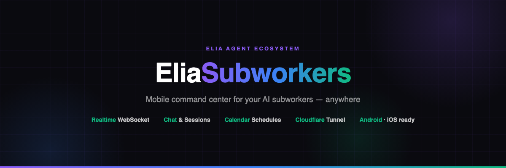

<!-- Banner -->
<p align="center">
  
</p>

<!-- Tagline -->
<p align="center">
  <strong>The mobile command center for the Elia agent ecosystem.</strong><br>
  Live subworker dashboard, chat streams, schedule calendar &amp; secure remote access — built with Expo / React Native.
</p>

<!-- Badges -->
<p align="center">
  
  
  
  
  <a href="LICENSE"></a>
</p>

---

## What Is This?

**EliaSubworkers** turns your phone into a real-time control room for the
[EliaAgent](https://github.com/vakandi/EliaAgent) subworker server. Watch every AI
agent live — status, streaming chat output, scheduled runs — trigger them on demand,
and reach the whole thing **from anywhere** through a free Cloudflare Tunnel.

It is one of three pieces of the ecosystem:

| Repo | What it is |
|---|---|
| [**EliaAgent**](https://github.com/vakandi/EliaAgent) | 🧠 The engine — FastAPI server + scheduler running your subworkers in Docker |
| **EliaAndroidApp** (this repo) | 📱 The mobile client — Android today, iOS via Expo |
| [**EliaTopBar**](https://github.com/vakandi/Elia-Topbar) | 🍎 The macOS menu-bar companion — native Swift, same realtime data & management |

---

## ✨ Features

### 🤖 Realtime Dashboard
- WebSocket-first connection with automatic HTTP polling fallback and smart reconnect backoff
- Home overview: connection state, server health (PID, restarts), running/enabled counters
- Quick actions to trigger idle agents in one tap

### 💬 Chat & Sessions
- Per-agent session browser with titles and message counts
- Full chat viewer: user/assistant bubbles, collapsible reasoning blocks ("Thinking…"), tool-call rows with input/output details
- Rich markdown rendering — code blocks, tables, blockquotes, headings
- Live mode: new parts stream in as the agent works

### 📅 Schedule Calendar
- Google-Calendar-style week view plotting every enabled agent's runs
- Understands both `interval` (hours list + minute) and `cron` schedules from the server
- Tap a slot to jump straight into that agent's latest chat; collisions open an agent picker with photos

### 📷 Profiles & Identity
- Per-agent profile photos (local-only, mirroring the macOS app)
- Monogram fallback everywhere photos are missing

### 🔔 Notifications
- Immediate local notifications for **every lifecycle event** — `started` → `finished` → `failed` — driven purely by WebSocket events (`subworker_started` / `subworker_completed` / `subworker_error`)
- Gated by **Settings → Agent run alerts** (on by default). When disabled, no notification is posted
- Android channel `subworker-events` with `HIGH` importance for heads-up banner + sound + vibration, even when the app is backgrounded
- Permission handled on first launch — see **Android permissions** below

### 🌍 Remote Access via Cloudflare Tunnel
- In-app wizard creates a **free Cloudflare Tunnel** for your own domain: token check → tunnel creation → DNS routing → connector startup → public verification, all step-by-step
- One-time setup on your LAN; afterwards the phone reaches the server from anywhere (4G/5G), and the connector survives restarts automatically
- Stable URL: whatever you set in **Settings → Server URL** stays exactly as set — no automatic fallback to localhost or LAN IP. If the domain is unreachable the app simply stays disconnected and retries

### 🔍 LAN Discovery
- One-tap network scan finds the server IP automatically (parallel probes, verified responses)

### 🔐 Shared-Token Auth
- Single admin token model (`Authorization: Bearer` / `X-Elia-Token` headers, `?token=` for WebSocket)
- Ships empty by default — set it in **Settings → Auth Token** to match your server's `ELIA_AUTH_TOKEN`

---

## 🚀 Quick Start

### 1. Run the server

Follow [EliaAgent](https://github.com/vakandi/EliaAgent) to bring up the FastAPI
subworker server (Docker, port `5656`) with your agents configured.

### 2. Build the app

```bash
git clone https://github.com/vakandi/EliaAndroidApp.git
cd EliaAndroidApp/mobile
npm install
npx expo prebuild -p android
cd android && ./gradlew assembleRelease
# APK → android/app/build/outputs/apk/release/app-release.apk
```

> For development you can also run `npx expo start` and open the project in Expo Go.

### 3. Connect

1. Open the app → **Settings → Server URL**
2. On the same Wi-Fi: type the server IP (port `5656` is added automatically) or tap **Scan network**
3. Paste your auth token (**Settings → Auth Token**) if the server has one set

### 4. (Optional) Go remote with Cloudflare

**Settings → Remote access → Cloudflare Tunnel** — enter your domain and a Cloudflare API
token (`Zone:DNS:Edit` + `Account:Cloudflare Tunnel:Edit`). The wizard does the rest.
Afterwards just use `https://your.domain` as the Server URL — no port, TLS included.

---

## 📲 Android Permissions

EliaSubworkers is intentionally minimal — no location, camera, microphone, contacts, or storage permissions. Notifications and networking are the only runtime-sensitive features.

| Permission | Declared in manifest | When required | What happens if denied |
|---|---|---|---|
| `INTERNET` | auto (Expo) | Always | App cannot reach the server at all |
| `VIBRATE` | `app.json` (+ channel) | Always (channel vibration) | Notifications still appear, just without haptic |
| `POST_NOTIFICATIONS` | `app.json` via `expo-notifications` plugin | **Android 13+ (API 33+)** — runtime prompt on first launch | System silently drops all notifications; app keeps working, banner never shows. Re-enable in **System Settings → Apps → Elia Subworkers → Notifications** |

### Behaviour per Android version

| Android version | What you see |
|---|---|
| **6–12 (API 23–32)** | Notifications are granted at install time. No prompt. Channel `subworker-events` is created as `HIGH` importance — heads-up banner + sound + vibration for `started` / `finished` / `failed`. Toggle in **Settings → Agent run alerts** controls posting. |
| **13+ (API 33+)** | On first app launch `initNotifications()` calls `getPermissionsAsync()` → `requestPermissionsAsync()`. System shows the standard *Allow notifications?* dialog. If you tap **Allow**, behaviour is identical to Android 12. If you tap **Don't allow**, you will never see run alerts until you re-enable them in system settings. The in-app toggle alone cannot override a system denial. |
| **14+ (API 34+)** | No `SCHEDULE_EXACT_ALARM` / `USE_EXACT_ALARM` needed. The app uses an **immediate trigger** (`trigger: null`) for local notifications, so no exact-alarm permission is requested. |

### Notification delivery details

- Channel ID: `subworker-events` (`HIGH` importance, `HIGH` priority, sound `default`, vibration `[0,250,250,250]`)
- Source: pure WebSocket events from `ws://<server>/ws` — no FCM, no background service, no polling
- Foreground: banner + list + sound; Background/killed: system still delivers via the notification channel (Expo local notification)
- Battery optimizations: if the OEM aggressively kills background apps, keep **Battery → Unrestricted** for Elia Subworkers if you want background `started`/`finished` alerts reliably

> **Troubleshooting:** *No notifications at all?* Check 1) **Settings → Agent run alerts** is ON, 2) **System Settings → Apps → Elia Subworkers → Notifications** is Allowed, 3) **Notification categories → Subworker events** is not muted, 4) you are actually receiving WebSocket events (connection shows *Connected* in the Home tab).

---

## 🏗 Architecture

```
┌─────────────────────────┐         ┌──────────────────────────┐
│   EliaSubworkers (app)  │         │   EliaTopBar (macOS)     │
│   Expo / React Native   │         │   Swift menu-bar client  │
└───────────┬─────────────┘         └────────────┬─────────────┘
            │  REST + WebSocket                  │ same API
            ▼                                    ▼
      ┌─────────────────────────────────────────────┐
      │        EliaAgent — FastAPI :5656            │
      │  subworker scheduler · sessions · logs      │
      │  /tunnel/* orchestration (cloudflared)      │
      └──────────────────┬──────────────────────────┘
                         ▼
              opencode CLI agents (per-subworker workspaces)
```

State lives in a single application-scoped zustand store mirroring the server's
WebSocket events; screens are thin consumers.

---

## 📖 Project Docs

| Doc | Content |
|---|---|
| [`PLAN.md`](PLAN.md) | Full build plan — phases, units, verification gates |
| [`MVP.md`](MVP.md) | Product requirements source of truth |
| [`docs/AUTHENTIFICATION.md`](docs/AUTHENTIFICATION.md) | Shared-token auth — server, app & TopBar setup |
| [`docs/CLOUDFLARE_SETUP.md`](docs/CLOUDFLARE_SETUP.md) | Tunnel setup walkthrough + troubleshooting |

---

## 🤝 Contributing

PRs welcome! Keep it lightweight — the app is intentionally a thin client over the
EliaAgent API. Bug reports are best filed with the exact screen and server log excerpt.

---

## 📄 License

MIT — see [LICENSE](LICENSE).
